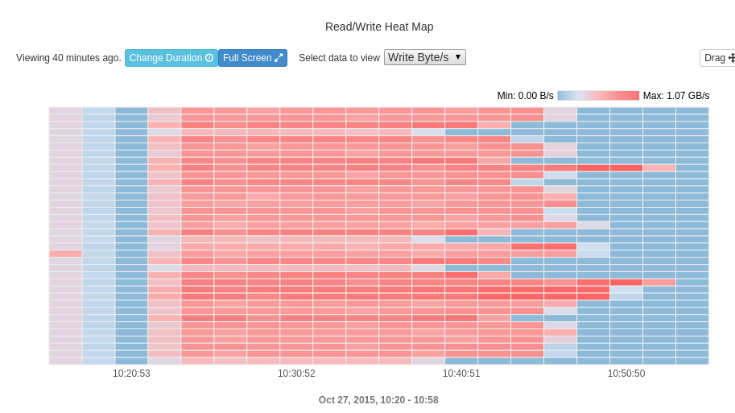
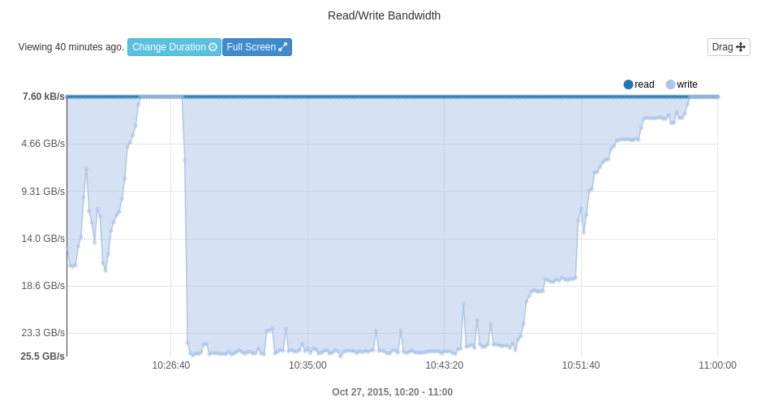
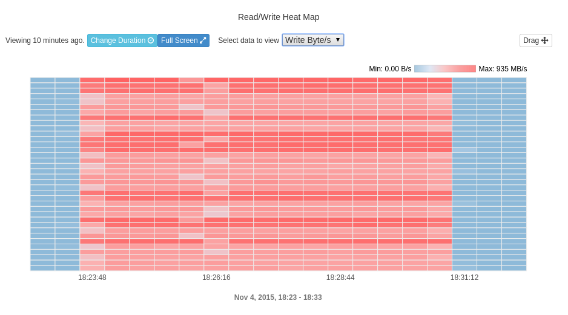
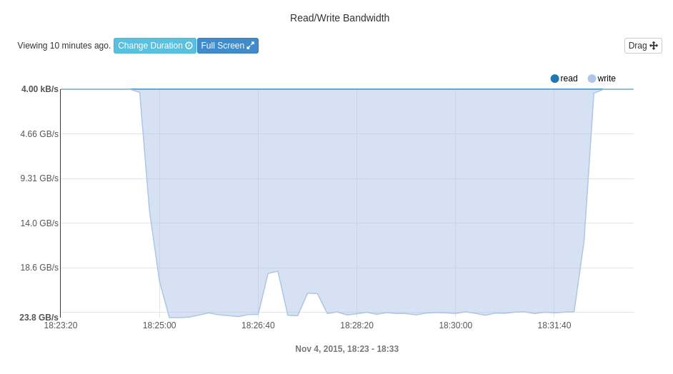

## Description

I/O benchmark for shared filesystems.  Only writes are supported now, as usually it slower that reads.

## Details

Shared filesystem usually can handle more IO than the local ones, so it is needed to test them using several nodes (clients). Because of the nature of concurrent access and probability theory, not all clients are operating with the same speed. Some are faster, other are slower.
The common approach of bencharking is to split desirable amount of data onto equal relatively large pieces (number of pieces is equal of the number of clients) and ask client to write (or read) those pieces independently. For instance if we specify 10TB for 10 clients, each client will write (read) 1TB of the data from shared file system.
As a result fastest process will write its 1TB and go to idle and benchmark will finish when the slowest processes put their data onto the storage. In many cases I/O from one or several client processes cannot saturate the bandwidth of the server and benchmark will measure not the performance of the shares storage, but the performance of the slowest processes: "a herd of buffalo can only move as fast as the slowest buffalo".

The other approach is a operate like a team: "do work for your lazy colleagues".
Here the whole amount of the data is split onto equal small pieces (chunks), and a single dedicated process is tracking how many of those pieces are fallen down to the filesystem. As a result, steady speed of I/O is all along the benchmark.

## Some ppictures
All pictures were captured from IEEL web-interface (Enterprise Lustre FS by Intel).

### FIO test from 50 nodes:

### MPIio from 50 nodes:

