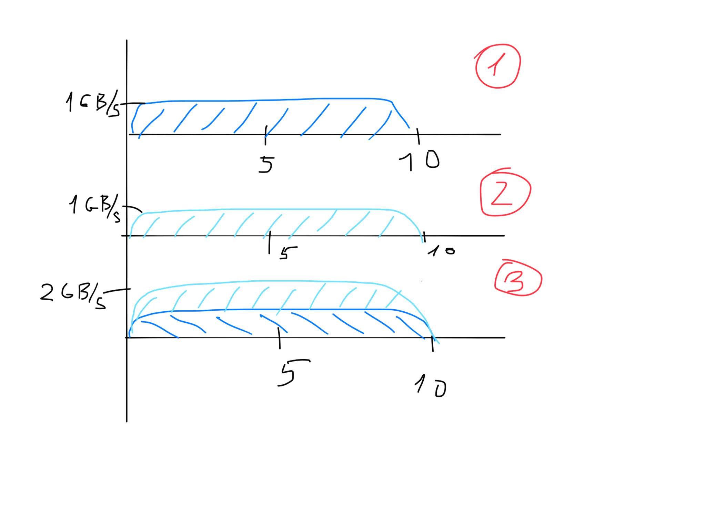
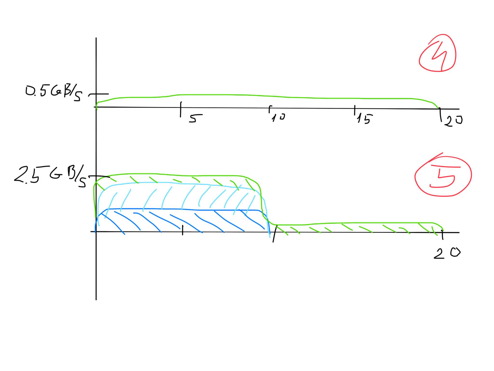

## Other naive explanation
Let's consider we have several OSS with the expected performance 1GB/sec
so if we are putting 10GB there the duration of the test will be 10sec (pic 1)
If we add 1 more OSS and another writer, we can reach 2 GB sec and duration will be the same (pic 3)

The profile of the summarized load will be just staked graph. And the data is falling on the storage will be an area under that curve. So far so good.

If we add third  oss with the performace 0.5GB/sec, desired performace should be 2.5 GB/sec
But benchmark will lasts 20 sec, because the area under the curve should be the same, as third writer should write the same amount of the data.
and the shacked graph will be like the one on picture 5.

From outside it will be like we put 30GB in 20 sec, so the measured performance will be 1.5GB/sec, not the 2.5 GB/sec

In more real example we can observe that the 1 OSS out of 100 can perform 5% weaker. So the expected performace should be 1GB/sec * 99 + 0.95GB/sec = 99.95 GB/sec. But observed performance will be 100GB/1.05 GB/sec = 95.24 GB/sec. So the gap of the same 5% (4.7% actually).
